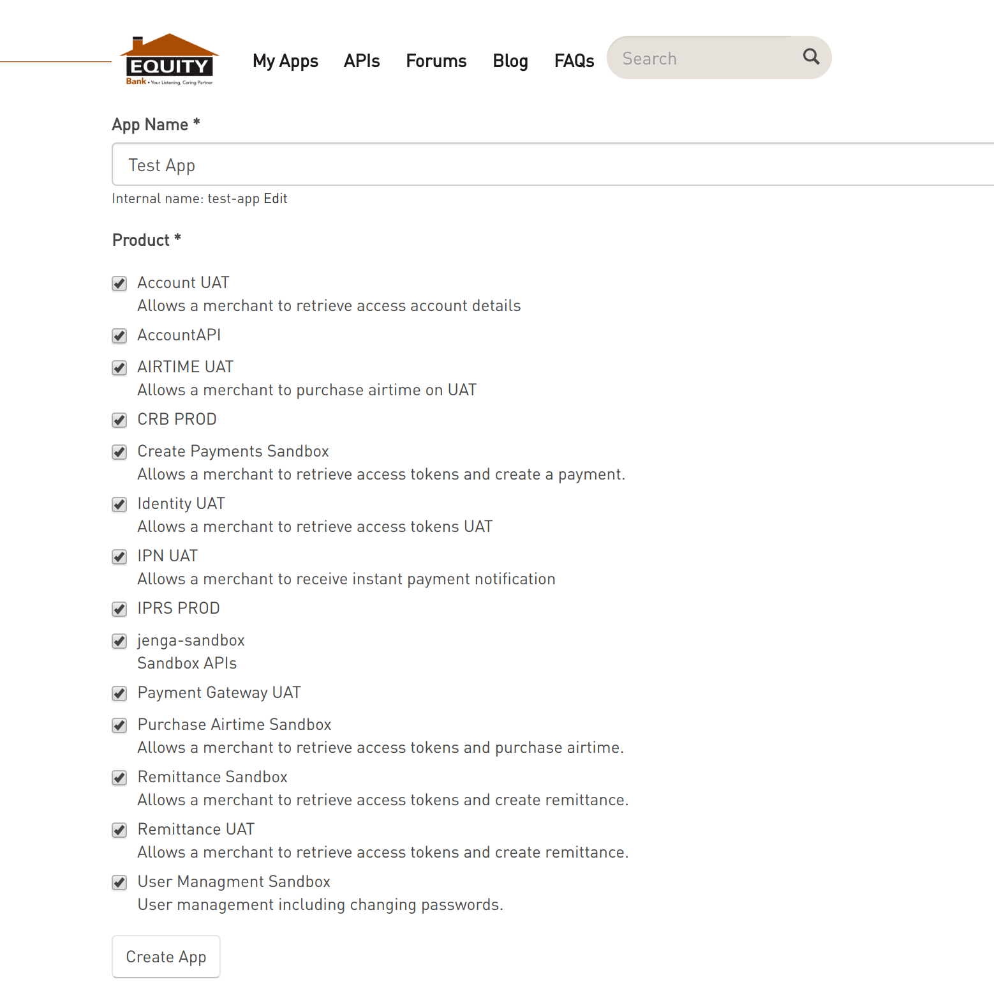
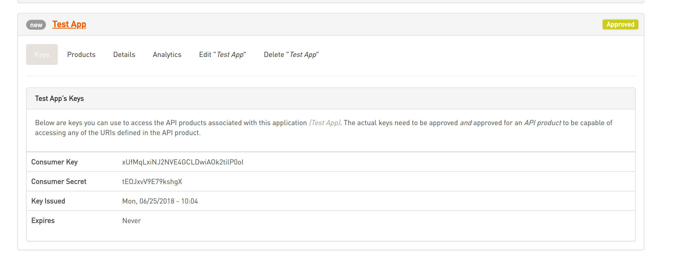

## Eazzy API

The Equity API is dubbed *Eazzy API* is The Ultimate Toolkit For Businesses and Merchants

Eazzy API is a platform that features new and disruptive capabilities. 
It converts Equity’s full range of expertise in payments, banking, insurance, brokerage, wealth management and telco into simple to use and secure APIs for ready integrations to mobile apps, e-commerce sites and other systems.

## Preamble

Eazzy API leverages off Equity’s robust technical capabilities and dominance in payments by exposing merchant payment tills services, mature payment and open payment APIs to all the mobile wallets, banks, debit and credit card association, social media, Loans, bulk transfers, real time forex and stocks prices and much more.
 
::: tip
A large number of businesses are now building their marketplace and internal financial processes using Eazzy APIs.
:::

## Getting started

Before we get started head over to [Equity Developer Portal](https://developers.equitybankgroup.com/user/register) and create a free account, or login if you already have one.

Then head  over to *My Apps* and create a sandbox app

Next, get app credential in the apps page

After you have the Credentials we can now proceed to setup this package.
